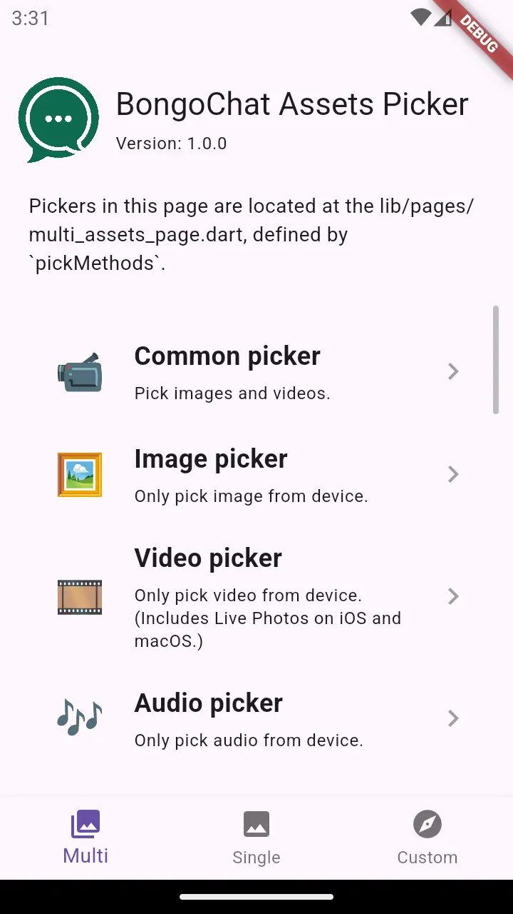
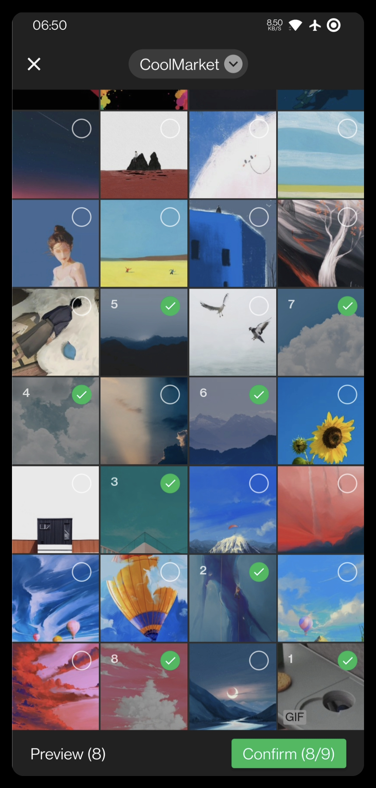
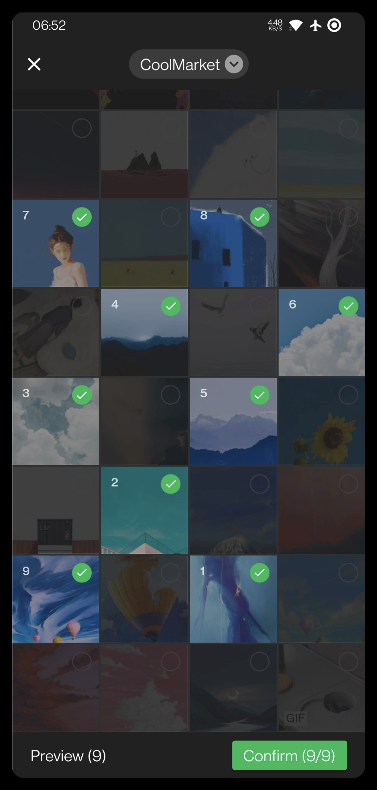
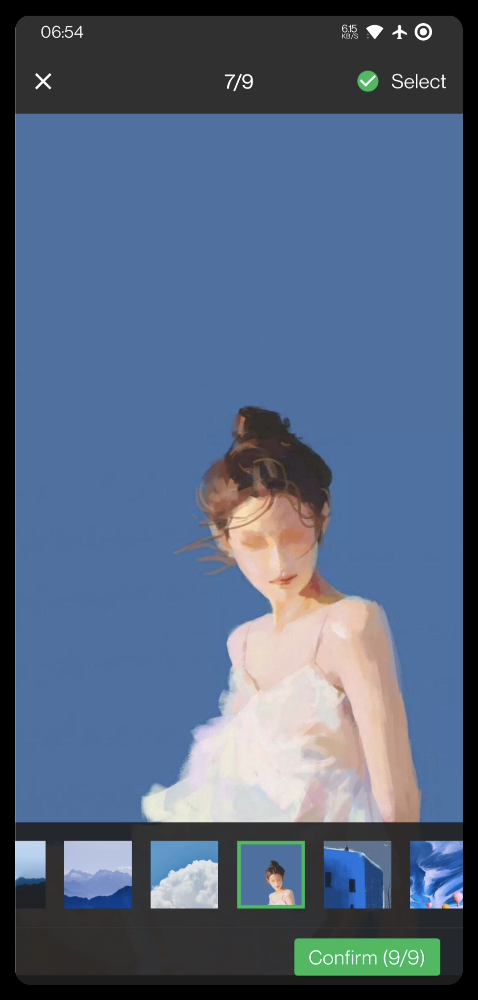
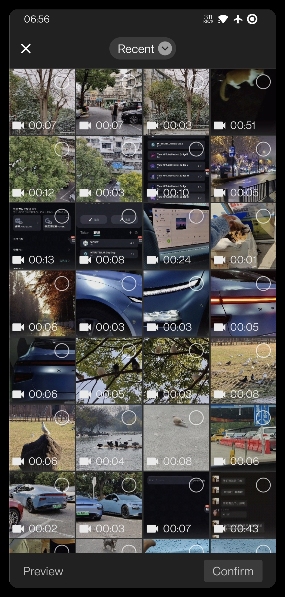
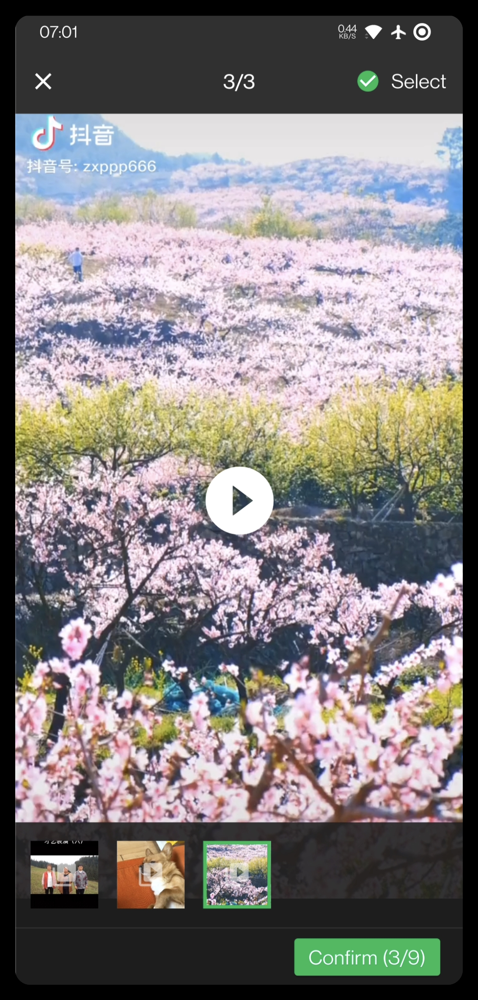
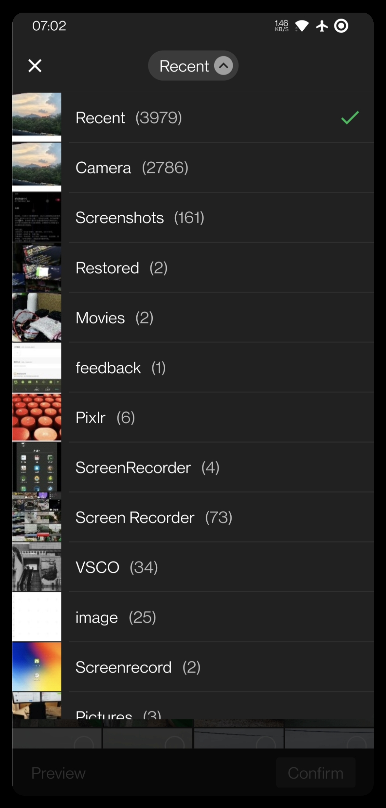
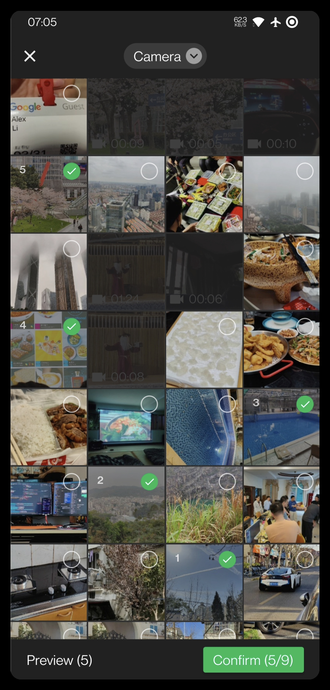
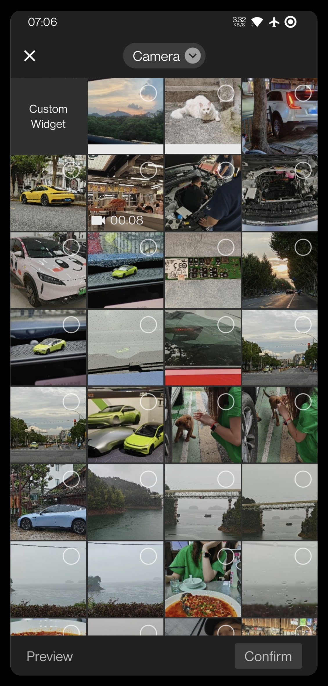

<!-- Copyright 2019 The bongochat author. All rights reserved.
Use of this source code is governed by an Apache license
that can be found in the LICENSE file. -->

# Flutter BongoChat Assets Picker

[](https://pub.dev/packages/assets_picker)
[](https://pub.dev/packages/assets_picker)
[](https://www.codefactor.io/repository/github/bongochat/flutter_assets_picker)

[](https://github.com/bongochat/flutter_assets_picker/actions/workflows/runnable.yml)
[](https://github.com/bongochat/flutter_assets_picker/blob/main/LICENSE)
[](https://github.com/bongochat/flutter_assets_picker/stargazers)
[](https://github.com/bongochat/flutter_assets_picker/network)

[](https://github.com/Solido/awesome-flutter)
[](https://jq.qq.com/?_wv=1027&k=5bcc0gy)

Language: English | [中文](README-ZH.md)

An **image picker (also with videos and audios)**
for Flutter projects based on the WeChat's UI.

Current WeChat version that UI based on: **8.3.x**
UI designs will be updated following the WeChat update in anytime.

To take a photo or a video for assets,
please check the detailed usage in the example,
and head over to [wechat_camera_picker][wechat_camera_picker pub].
The package is a standalone extension that can to be used with combination.

See the [Migration Guide][] to learn how to migrate between breaking changes.

## Versions compatibility

The package only guarantees to be working on **the stable version of Flutter**.
We won't update it in real-time to align with other channels of Flutter.

|        | 3.0 | 3.3 | 3.7 | 3.10 | 3.13 | 3.16 |
|--------|:---:|:---:|:---:|:----:|:----:|:----:|
| 8.9.0+ |  ❌  |  ❌  |  ❌  |  ❌   |  ❌   |  ✅   |
| 8.7.0+ |  ❌  |  ❌  |  ❌  |  ❌   |  ✅   |  ❌   |
| 8.5.0+ |  ❌  |  ❌  |  ❌  |  ✅   |  ❌   |  ❌   |
| 8.4.0+ |  ❌  |  ❌  |  ✅  |  ❌   |  ❌   |  ❌   |
| 8.0.0+ |  ✅  |  ✅  |  ❌  |  ❌   |  ❌   |  ❌   |
| 7.3.0+ |  ✅  |  ✅  |  ❌  |  ❌   |  ❌   |  ❌   |

If you got a `resolve conflict` error when running `flutter pub get`,
please use `dependency_overrides` to fix it.

## Package credits

The package is built from these wonderful packages.

| Name                                 | Features                                             |
|:-------------------------------------|:-----------------------------------------------------|
| [photo_manager][photo_manager pub]   | The basic abstractions and management for assets.    |
| [extended_image][extended_image pub] | Preview assets with expected behaviors.              |
| [provider][provider pub]             | Helps to manage the interaction state of the picker. |
| [video_player][video_player pub]     | Plays videos and audios correspondingly.             |
 
Their implementation should be relatively stable in the package.
If you've found any issues related to them when using the picker,
submit issues to our issue tracker first.

<details>
  <summary>Table of content</summary>

<!-- TOC -->
* [Flutter WeChat Assets Picker](#flutter-wechat-assets-picker)
  * [Versions compatibility](#versions-compatibility)
  * [Package credits](#package-credits)
  * [Features ✨](#features-)
    * [Notes 📝](#notes-)
  * [Projects using this plugin 🖼️](#projects-using-this-plugin-)
  * [Screenshots 📸](#screenshots-)
  * [READ THIS FIRST ‼️](#read-this-first-)
  * [Preparing for use 🍭](#preparing-for-use-)
    * [Flutter](#flutter)
    * [Android](#android)
      * [Permissions](#permissions)
    * [iOS](#ios)
    * [macOS](#macos)
  * [Usage 📖](#usage-)
    * [Localizations](#localizations)
    * [Simple usage](#simple-usage)
    * [Detailed usage](#detailed-usage)
      * [Display selected assets](#display-selected-assets)
      * [Register assets change observe callback](#register-assets-change-observe-callback)
      * [Upload an `AssetEntity` with a form data](#upload-an-assetentity-with-a-form-data)
        * [With `http`](#with-http)
        * [With `dio`](#with-dio)
    * [Custom pickers](#custom-pickers)
  * [Frequently asked question ❔](#frequently-asked-question-)
    * [Execution failed for task ':photo_manager:compileDebugKotlin'](#execution-failed-for-task-photomanagercompiledebugkotlin)
    * [Create `AssetEntity` from `File` or `Uint8List` (rawData)](#create-assetentity-from-file-or-uint8list-rawdata)
    * [Glide warning 'Failed to find GeneratedAppGlideModule'](#glide-warning-failed-to-find-generatedappglidemodule)
  * [Contributors ✨](#contributors-)
  * [Credits](#credits)
<!-- TOC -->
</details>

## Features ✨

- ♿ Complete a11y support with _TalkBack_ and _VoiceOver_
- ♻️ Fully customizable with delegates override
- 🎏 Fully customizable theme based on `ThemeData`
- 💚 Completely WeChat style (even more)
- ⚡️ Adjustable performance with different configurations
- 📷 Image support
  - 🔬 HEIF Image type support <a href="#notes-"><sup>(1)</sup></a>
- 🎥 Video support
- 🎶 Audio support <a href="#notes-"><sup>(2)</sup></a>
- 1️⃣ Single picking mode
- 💱 Internationalization (i18n) support
  - ⏪ RTL language support
- ➕ Special item builder support
- 🗂 Custom sort path delegate support
- 📝 Custom text delegate support
- ⏳ Custom filter options support
- 💻 macOS support

### Notes 📝

1. HEIF (HEIC) images are support to obtain and conversion,
   but the display with them are based on Flutter's image decoder.
   See [flutter/flutter#20522](https://github.com/flutter/flutter/issues/20522).
   Use `entity.file` or `AssetEntityImage` for them when displays.
2. Due to limitations on iOS and macOS, audio can only be fetched within the sandbox.

## Projects using this plugin 🖼️

| name                | pub                                                                                                              | github                                                                                                                                        |
|:--------------------|:-----------------------------------------------------------------------------------------------------------------|:----------------------------------------------------------------------------------------------------------------------------------------------|
| insta_assets_picker | [](https://pub.dev/packages/insta_assets_picker) | [](https://github.com/LeGoffMael/insta_assets_picker) |

## Screenshots 📸

|                           |                           |                           |
|----------------------------------------------------------|----------------------------------------------------------|----------------------------------------------------------|
|                           |                           |                           |
|                           |                           |                           |
|  |  |  |

## READ THIS FIRST ‼️

Be aware of below notices before you started anything:
- Due to understanding differences and the limitation of a single document,
  documents will not cover all the contents.
  If you find nothing related to your expected features and cannot understand about concepts,
  run the example project and check every options first.
  It has covered 90% of regular requests with the package.
- The package deeply integrates with the [photo_manager][photo_manager pub] plugin,
  make sure you understand these two concepts as much as possible:
  - Asset (photos/videos/audio) - [`AssetEntity`](https://pub.dev/documentation/photo_manager/latest/photo_manager/AssetEntity-class.html)
  - Assets collection (albums/libraries) - [`AssetPathEntity`](https://pub.dev/documentation/photo_manager/latest/photo_manager/AssetPathEntity-class.html)

When you have questions about related APIs and behaviors,
check [photo_manager's API docs][] for more details.

Most usages are detailed covered by the [example](example).
Please walk through the [example](example) carefully
before you have any questions.

## Preparing for use 🍭

### Flutter

Run `flutter pub add assets_picker`,
or add `assets_picker` to `pubspec.yaml` dependencies manually.
```yaml
dependencies:
  assets_picker: ^latest_version
```

The latest **stable** version is:
[](https://pub.dev/packages/assets_picker)

The latest **dev** version is:
[](https://pub.dev/packages/assets_picker)

Then import the package in your code:
```dart
import 'package:assets_picker/assets_picker.dart';
```

### Android

When using the package, please upgrade
`targetSdkVersion` and `compileSdkVersion` to `33`.
Otherwise, no assets can be fetched on Android 13.

#### Permissions

| Name                     | Required | Declared | Max API Level | Others                       |
|--------------------------|----------|----------|---------------|------------------------------|
| `READ_EXTERNAL_STORAGE`  | YES      | YES      | 32            |                              |
| `WRITE_EXTERNAL_STORAGE` | NO       | NO       | 29            |                              |
| `ACCESS_MEDIA_LOCATION`  | YES*     | NO       | N/A           | Required when reading EXIF   |
| `READ_MEDIA_IMAGES`      | YES*     | YES      | N/A           | Required when reading images | 
| `READ_MEDIA_VIDEO`       | YES*     | YES      | N/A           | Required when reading videos | 
| `READ_MEDIA_AUDIO`       | YES*     | YES      | N/A           | Required when reading audios | 

If you're targeting Android SDK 33+,
and you don't need to load photos, videos or audios,
consider declare only relevant permission in your apps, more specifically:

```xml
<manifest xmlns:android="http://schemas.android.com/apk/res/android"
    xmlns:tools="http://schemas.android.com/tools"
    package="com.your.app">
    <!--Requesting access to images and videos.-->
    <uses-permission android:name="android.permission.READ_MEDIA_IMAGES" />
    <uses-permission android:name="android.permission.READ_MEDIA_VIDEO" />
    <!--When your app has no need to access audio, remove it or comment it out.-->
    <!--<uses-permission android:name="android.permission.READ_MEDIA_AUDIO" />-->
</manifest>
```

### iOS

1. Platform version has to be at least *11.0*.
   Modify `ios/Podfile` and update accordingly.
   ```Podfile
   platform :ios, '11.0'
   ```
   Remove the `#` heading if the line starts with it.
2. Add the following content to `Info.plist`.
```
<key>NSPhotoLibraryUsageDescription</key>
<string>Replace with your permission description.</string>
```

### macOS

1. Platform version has to be at least *10.15*.
   Modify `macos/Podfile` and update accordingly.
   ```ruby
   platform :osx, '10.15'
   ```
   Remove the `#` heading if the line starts with it.
2. Set the minimum deployment target of the macOS to *10.15*.
   Use XCode to open `macos/Runner.xcworkspace` .
3. Follow the [iOS](#iOS) instructions and modify `Info.plist` accordingly.

## Usage 📖

### Localizations

When you're picking assets, the package will obtain the `Locale?`
from your `BuildContext`, and return the corresponding text delegate
of the current language.
Make sure you have a valid `Locale` in your widget tree that can be accessed
from the `BuildContext`. **Otherwise, the default Chinese delegate will be used.**

Embedded text delegates languages are:
* 简体中文 (default)
* English
* העברית
* Deutsche
* Локализация
* 日本語
* مة العربية
* Délégué
* Tiếng Việt
* Türkçe Yerelleştirme

If you want to use a custom/fixed text delegate, pass it through the
`AssetPickerConfig.textDelegate`.

### Simple usage

```dart
final List<AssetEntity>? result = await AssetPicker.pickAssets(context);
```

Use `AssetPickerConfig` for more picking behaviors.

```dart
final List<AssetEntity>? result = await AssetPicker.pickAssets(
  context,
  pickerConfig: const AssetPickerConfig(),
);
```

Fields in `AssetPickerConfig`:

| Name                              | Type                                 | Description                                                                                  | Default                     |
|-----------------------------------|--------------------------------------|----------------------------------------------------------------------------------------------|-----------------------------|
| selectedAssets                    | `List<AssetEntity>?`                 | Selected assets. Prevent duplicate selection.                                                | `null`                      |
| maxAssets                         | `int`                                | Maximum asset that the picker can pick.                                                      | 9                           |
| pageSize                          | `int?`                               | Number of assets per page. **Must be a multiple of `gridCount`**.                            | 80                          |
| gridThumbnailSize                 | `ThumbnailSize`                      | Thumbnail size for the grid's item.                                                          | `ThumbnailSize.square(200)` |
| pathThumbnailSize                 | `ThumbnailSize`                      | Thumbnail size for the path selector.                                                        | `ThumbnailSize.square(80)`  |
| previewThumbnailSize              | `ThumbnailSize?`                     | Preview thumbnail size in the viewer.                                                        | `null`                      |
| requestType                       | `RequestType`                        | Request type for picker.                                                                     | `RequestType.common`        |
| specialPickerType                 | `SpecialPickerType?`                 | Provides the option to integrate a custom picker type.                                       | `null`                      |
| keepScrollOffset                  | `bool`                               | Whether the picker should save the scroll offset between pushes and pops.                    | `null`                      |
| sortPathDelegate                  | `SortPathDelegate<AssetPathEntity>?` | Path entities sort delegate for the picker, sort paths as you want.                          | `CommonSortPathDelegate`    |
| sortPathsByModifiedDate           | `bool`                               | Whether to allow sort delegates to sort paths with `FilterOptionGroup.containsPathModified`. | `false`                     |
| filterOptions                     | `PMFilter?`                          | Allow users to customize assets filter options.                                              | `null`                      |
| gridCount                         | `int`                                | Grid count in picker.                                                                        | 4                           |
| themeColor                        | `Color?`                             | Main theme color for the picker.                                                             | `Color(0xff00bc56)`         |
| pickerTheme                       | `ThemeData?`                         | Theme data provider for the picker and the viewer.                                           | `null`                      |
| textDelegate                      | `AssetPickerTextDelegate?`           | Text delegate for the picker, for customize the texts.                                       | `AssetPickerTextDelegate()` |
| specialItemPosition               | `SpecialItemPosition`                | Allow users set a special item in the picker with several positions.                         | `SpecialItemPosition.none`  |
| specialItemBuilder                | `SpecialItemBuilder?`                | The widget builder for the special item.                                                     | `null`                      |
| loadingIndicatorBuilder           | `IndicatorBuilder?`                  | Indicates the loading status for the builder.                                                | `null`                      |
| selectPredicate                   | `AssetSelectPredicate`               | Predicate whether an asset can be selected or unselected.                                    | `null`                      |
| shouldRevertGrid                  | `bool?`                              | Whether the assets grid should revert.                                                       | `null`                      |
| limitedPermissionOverlayPredicate | `LimitedPermissionOverlayPredicate?` | Predicate whether the limited permission overlay should be displayed.                        | `null`                      |
| pathNameBuilder                   | `PathNameBuilder<AssetPathEntity>?`  | Build customized path (album) name with the given path entity.                               | `null`                      |

- When `maxAssets` equals to `1` (a.k.a. single picking mode),
  use `SpecialPickerType.noPreview` will immediately select asset
  clicked (pressed) by the user and popped.
- `limitedPermissionOverlayPredicate` lives without persistence,
  if you want to ignore the limited preview after restart,
  you'll need to integrate with your own saving methods.

### Detailed usage

We've put multiple common usage
with the packages in the [example](example).
You can both found `List<PickMethod> pickMethods` in
[here](example/lib/pages/multi_assets_page.dart)
and [here](example/lib/pages/single_assets_page.dart),
which provide methods in multiple picking and single picking mode.
Assets will be stored temporary and displayed at the below of the page.

#### Display selected assets

The `AssetEntityImage` and `AssetEntityImageProvider`
can display the thumb image of _images & videos_,
and the original data of _image_.
Use it like a common `Image` and `ImageProvider`.

```dart
AssetEntityImage(asset, isOriginal: false);
```

Or:

```dart
Image(image: AssetEntityImageProvider(asset, isOriginal: false));
```

#### Register assets change observe callback

```dart
// Register callback.
AssetPicker.registerObserve();

// Unregister callback.
AssetPicker.unregisterObserve();
```

#### Upload an `AssetEntity` with a form data

There are multiple ways to upload an `AssetEntity` with I/O related methods.
**Be aware, I/O related methods will consume performance
(typically time and memory), they should not be called frequently.**

##### With `http`

`http` package: https://pub.dev/packages/http

The `http` package uses
[`MultipartFile`](https://pub.dev/documentation/http/latest/http/MultipartFile-class.html)
to handle files in requests.

Pseudo code:
```dart
import 'package:http/http.dart' as http;

Future<void> upload() async {
  final entity = await obtainYourEntity();
  final uri = Uri.https('example.com', 'create');
  final request = http.MultipartRequest('POST', uri)
    ..fields['test_field'] = 'test_value'
    ..files.add(await multipartFileFromAssetEntity(entity));
  final response = await request.send();
  if (response.statusCode == 200) {
    print('Uploaded!');
  }
}

Future<http.MultipartFile> multipartFileFromAssetEntity(AssetEntity entity) async {
  http.MultipartFile mf;
  // Using the file path.
  final file = await entity.file;
  if (file == null) {
    throw StateError('Unable to obtain file of the entity ${entity.id}.');
  }
  mf = await http.MultipartFile.fromPath('test_file', file.path);
  // Using the bytes.
  final bytes = await entity.originBytes;
  if (bytes == null) {
    throw StateError('Unable to obtain bytes of the entity ${entity.id}.');
  }
  mf = http.MultipartFile.fromBytes('test_file', bytes);
  return mf;
}
```

##### With `dio`

`dio` package: https://pub.dev/packages/dio

The `dio` package also uses
[`MultipartFile`](https://pub.dev/documentation/dio/latest/dio/MultipartFile-class.html)
to handle files in requests.

Pseudo code:
```dart
import 'package:dio/dio.dart' as dio;

Future<void> upload() async {
  final entity = await obtainYourEntity();
  final uri = Uri.https('example.com', 'create');
  final response = dio.Dio().requestUri(
    uri,
    data: dio.FormData.fromMap({
      'test_field': 'test_value',
      'test_file': await multipartFileFromAssetEntity(entity),
    }),
  );
  print('Uploaded!');
}

Future<dio.MultipartFile> multipartFileFromAssetEntity(AssetEntity entity) async {
  dio.MultipartFile mf;
  // Using the file path.
  final file = await entity.file;
  if (file == null) {
    throw StateError('Unable to obtain file of the entity ${entity.id}.');
  }
  mf = await dio.MultipartFile.fromFile(file.path);
  // Using the bytes.
  final bytes = await entity.originBytes;
  if (bytes == null) {
    throw StateError('Unable to obtain bytes of the entity ${entity.id}.');
  }
  mf = dio.MultipartFile.fromBytes(bytes);
  return mf;
}
```

### Custom pickers

`AssetPickerBuilderDelegate`, `AssetPickerViewerBuilderDelegate`,
`AssetPickerProvider` and `AssetPickerViewerProvider`
are all exposed and overridable.
You can extend them and use your own
type with generic type `<A: Asset, P: Path>`,
then implement abstract methods.

To know about how to fully customize themes, widgets or layouts.
See how to customize delegates in the custom pickers page in the
[example](example/lib/customs/pickers).

You can submit PRs to create your own implementation
if you found your implementation might be useful for others.
See [Contribute custom implementations][] for more details.

## Frequently asked question ❔

### Execution failed for task ':photo_manager:compileDebugKotlin'

See [photo_manager#561][] for more details.

### Create `AssetEntity` from `File` or `Uint8List` (rawData)

In order to combine this package with camera shooting or something related,
there's a solution about how to create an `AssetEntity`
with `File` or `Uint8List` object.

```dart
final File file = your_file; // Your `File` object
final String path = file.path;
final AssetEntity fileEntity = await PhotoManager.editor.saveImageWithPath(
  path,
  title: basename(path),
); // Saved in the device then create an AssetEntity

final Uint8List data = your_data; // Your `Uint8List` object
final AssetEntity imageEntity = await PhotoManager.editor.saveImage(
  file.path,
  title: 'title_with_extension.jpg',
); // Saved in the device then create an AssetEntity
```

**Notice: If you don't want to keep the file in your device,
use `File` for operations as much as possible.**
Deleting an `AssetEntity` might cause system popups show:

```dart
final List<String> result = await PhotoManager.editor.deleteWithIds(
  <String>[entity.id],
);
```

See [photo_manager#from-raw-data][]
and [photo_manager#delete-entities][]
for more details.

### Glide warning 'Failed to find GeneratedAppGlideModule'

```
W/Glide   (21133): Failed to find GeneratedAppGlideModule. 
                   You should include an annotationProcessor compile dependency on com.github.bumptech.glide:compiler
                   in you application ana a @GlideModule annotated AppGlideModule implementation
                   or LibraryGlideModules will be silently ignored.
```

`Glide` needs annotation to keep singleton,
prevent conflict between instances and versions,
so while the photo manager uses `Glide` to implement image features,
the project which import this should define its own `AppGlideModule`.
See [Glide Generated API docs][] for implementation.

## Contributors ✨

Many thanks to these wonderful people ([emoji key](https://allcontributors.org/docs/en/emoji-key)):
<!-- ALL-CONTRIBUTORS-LIST:START - Do not remove or modify this section -->
<!-- prettier-ignore-start -->
<!-- markdownlint-disable -->
<table>
  <tbody>
    <tr>
      <td align="center" valign="top" width="14.28%"><a href="https://bongochat.com.bd/sajib"><br /><sub><b>Sajib Hossain</b></sub></a><br /><a href="https://github.com/bongochat/flutter_assets_picker/commits?author=sajib1066" title="Code">💻</a> <a href="#design-sajib1066" title="Design">🎨</a> <a href="https://github.com/bongochat/flutter_assets_picker/commits?author=sajib1066" title="Documentation">📖</a> <a href="#example-sajib1066" title="Examples">💡</a> <a href="#ideas-sajib1066" title="Ideas, Planning, & Feedback">🤔</a> <a href="#maintenance-sajib1066" title="Maintenance">🚧</a> <a href="#question-sajib1066" title="Answering Questions">💬</a> <a href="https://github.com/bongochat/flutter_assets_picker/pulls?q=is%3Apr+reviewed-by%sajib1066" title="Reviewed Pull Requests">👀</a> <a href="#a11y-sajib1066" title="Accessibility">️️️️♿️</a> <a href="#translation-sajib1066" title="Translation">🌍</a></td>
    </tr>
  </tbody>
</table>

<!-- markdownlint-restore -->
<!-- prettier-ignore-end -->

<!-- ALL-CONTRIBUTORS-LIST:END -->
This project follows the
[all-contributors](https://github.com/all-contributors/all-contributors) specification.
Contributions of any kind welcomed!!

## Credits

> Every aspect of IntelliJ IDEA has been designed to maximize developer productivity.
Together, intelligent coding assistance and ergonomic design make development not only productive but also enjoyable.

Thanks to [JetBrains](https://www.jetbrains.com/?from=bongochat)
for allocating free open-source licenses for IDEs
such as [IntelliJ IDEA](https://www.jetbrains.com/idea/?from=bongochat).

[](https://www.jetbrains.com/?from=bongochat)


[photo_manager pub]: https://pub.dev/packages/photo_manager
[extended_image pub]: https://pub.dev/packages/extended_image
[provider pub]: https://pub.dev/packages/provider
[video_player pub]: https://pub.dev/packages/video_player
[wechat_camera_picker pub]: https://pub.dev/packages/wechat_camera_picker
[Migration Guide]: https://github.com/bongochat/flutter_assets_picker/blob/main/guides/migration_guide.md
[photo_manager's API docs]: https://pub.dev/documentation/photo_manager/latest/
[Glide Generated API docs]: https://sjudd.github.io/glide/doc/generatedapi.html
[Contribute custom implementations]: https://github.com/bongochat/flutter_assets_picker/blob/main/example/lib/customs/CONTRIBUTING.md
[photo_manager#561]: https://github.com/bongochat/flutter_photo_manager/issues/561
[photo_manager#from-raw-data]: https://github.com/bongochat/flutter_photo_manager#from-raw-data
[photo_manager#delete-entities]: https://github.com/bongochat/flutter_photo_manager#delete-entities
